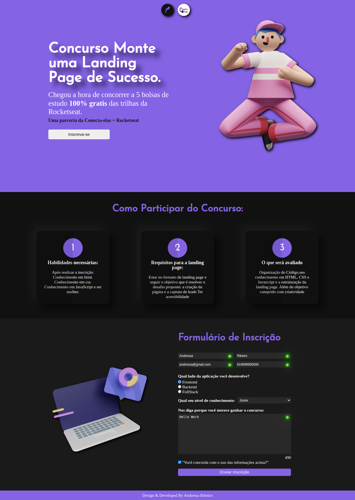

  
# Landing Page ConectaElas + Rocketseat
 
O objetivo deste projeto foi Desenvolver uma landing page para divulgar o concurso de bolsas de estudo da Rocketseat com o Conecta Elas e captar leads. 
Os principais requisitos para participar desse projeto foram organização do Código, seu conhecimento em HTML, CSS e Javascript e a estruturação da landing page. 
Além do objetivo cumprido com criatividade e a criação de um formulário com validação dos dados.
  
## Demonstração

 

## Tecnologias e Ferramentas utilizadas:

<h1 align='center'>

</h1>

